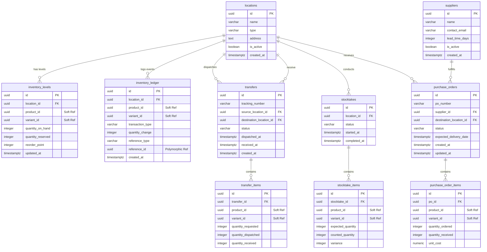
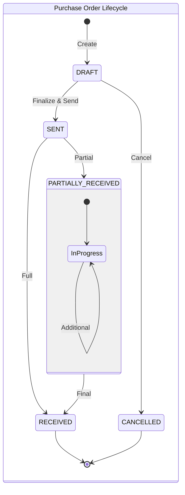
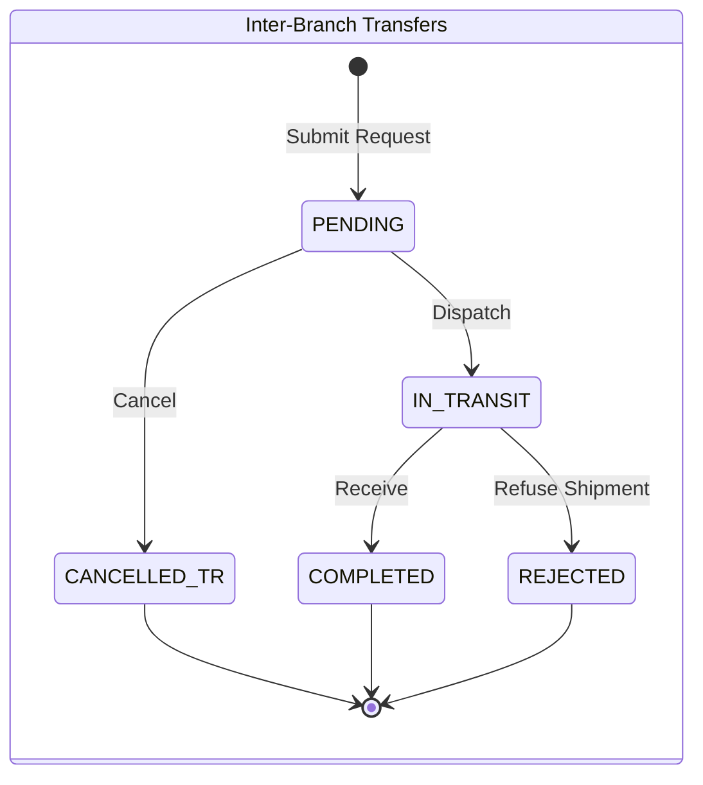
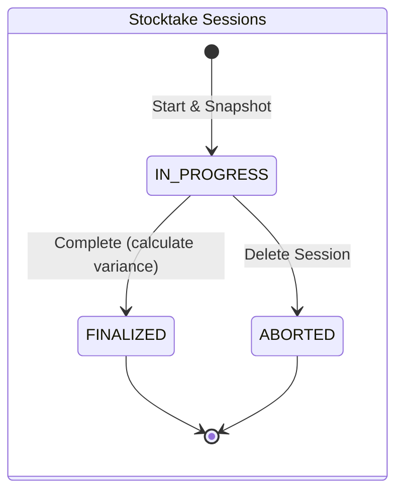
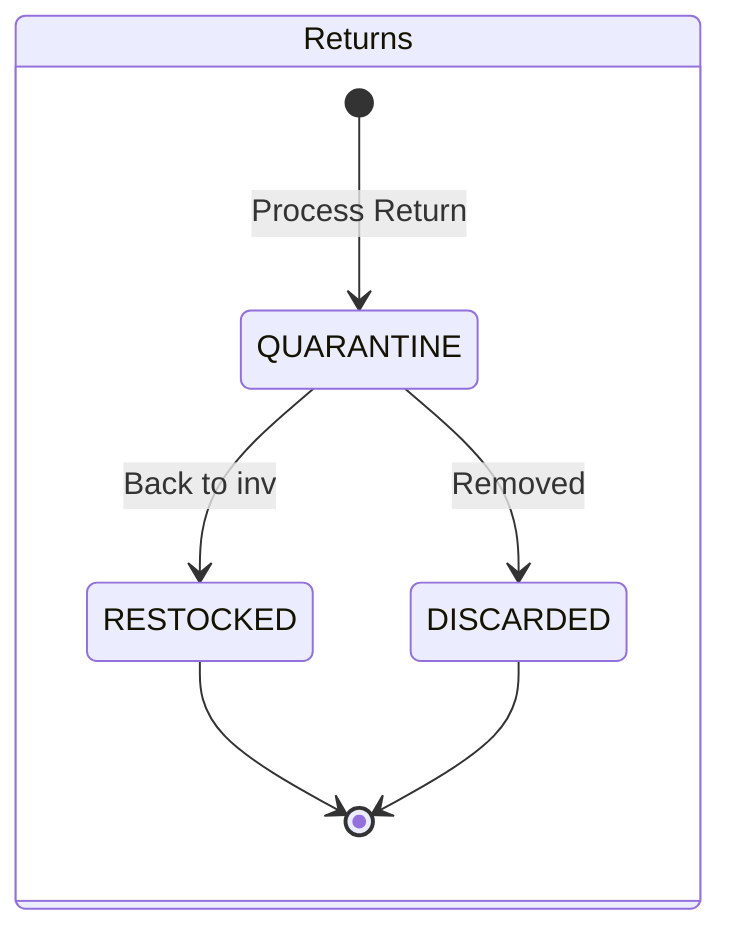

# Inventory Ledger
This project is a standalone backend for `inventory ledger`. This project meant to be one of many microservices of my POS project. One thing to note is `product_id` and `variance` is soft reference. Since its live off on another db and managed from another service. I haven't solve this, just yet.

## Tech Stack 
- **Runtime:** Node.js
- **Framework:** NestJS
- **Language:** TypeScript
- **Database:** PostgreSQL
- **Query builder:** Kysely
- **Docs:** Swagger
  
## Installation
 
```bash
#In root directory
pnpm install
pnpm run migrate
pnpm run dev
```

Seeding:
```bash
pnpm run db:seed
```

Reset database:
```bash
pnpm run db:reset
```

Start fresh database:
```bash
pnpm run db:fresh
```
 
Health check:
```bash
curl http://localhost:8080/api/health
```

## ER Diagram


## Inventory Lifecycle





## Endpoints

### 0. System Health & Core

| Method | Endpoint | Description |
| --- | --- | --- |
| `GET` | `/api/health` | Service health and uptime status check |
| `GET` | `/api/docs`   | API Documentation |

### 1. Logistics Foundation (Core Inventory)

#### Locations

Manage physical stores, warehouses, and virtual zones.

| Method | Endpoint | Description |
| --- | --- | --- |
| `GET` | `/api/locations` | List all stores, warehouses, and virtual zones |
| `GET` | `/api/locations/:id` | Get details for a single location |
| `POST` | `/api/locations` | Create a new location (`STORE`, `WAREHOUSE`, or `VIRTUAL`) |
| `PATCH` | `/api/locations/:id` | Update location details or deactivate (`is_active: false`) |

#### Inventory Levels

Track and adjust real-time stock balances across locations.

| Method | Endpoint | Description |
| --- | --- | --- |
| `GET` | `/api/locations/:id/inventory` | Fetch paginated stock levels for a specific location (`limit` & `offset` required) |
| `GET` | `/api/locations/:id/inventory/:productId` | Get real-time stock level & inline `reorder_threshold` for a product at a location |
| `GET` | `/api/products/:id/inventory` | View stock level breakdown across all locations for a specific product |
| `PATCH` | `/api/locations/:id/inventory/:productId/reorder-threshold` | Set minimum reorder point threshold for a product at a specific location |
| `GET` | `/api/inventory/low-stock` | Cross-location view of products falling below their reorder point |
| `POST` | `/api/inventory/adjust` | Perform manual stock adjustments; updates stock and writes `SHRINKAGE` or `CORRECTION` log |

#### Audit Ledger

Immutable audit trail tracking all historical stock movements.

| Method | Endpoint | Description |
| --- | --- | --- |
| `GET` | `/api/inventory/ledger` | Query audit trail filterable by product, location, or date |
| `GET` | `/api/inventory/ledger/:id` | Retrieve single ledger entry details for deep audit drill-downs |

### 2. Purchase Orders (Supplier Procurement)

#### Suppliers

Manage vendor and supplier directory information.

| Method | Endpoint | Description |
| --- | --- | --- |
| `GET` | `/api/suppliers` | List all suppliers and contact details |
| `GET` | `/api/suppliers/:id` | Get single supplier details |
| `POST` | `/api/suppliers` | Register a new supplier |
| `PATCH` | `/api/suppliers/:id` | Update supplier details or deactivate (`is_active: false`) |

#### Purchase Orders

Draft, manage, and transition inbound procurement orders.

| Method | Endpoint | Description |
| --- | --- | --- |
| `GET` | `/api/purchase-orders` | List POs with optional filtering by status |
| `GET` | `/api/purchase-orders/:id` | View full PO details and nested line items |
| `POST` | `/api/purchase-orders` | Create a `DRAFT` PO with requested items and quantities |
| `PATCH` | `/api/purchase-orders/:id` | Edit line items and quantities while PO status is `DRAFT` |
| `PATCH` | `/api/purchase-orders/:id/status` | Transition PO state (`DRAFT` ➔ `SENT` / `CANCELLED`) |
| `DELETE` | `/api/purchase-orders/:id` | Hard-delete an un-sent `DRAFT` PO |

#### Receiving Engine

Inbound stock processing and partial receiving workflow.

| Method | Endpoint | Description |
| --- | --- | --- |
| `POST` | `/api/purchase-orders/:id/receive` | Process scanned items, update `quantity_received`, increment stock, and write `RECEIPT` ledger |
| `GET` | `/api/purchase-orders/:id/receipts` | Historical breakdown of partial receiving events against a PO |

### 3. Inter-Branch Transfers

#### Transfer Management

Request and track stock movements between internal locations.

| Method | Endpoint | Description |
| --- | --- | --- |
| `GET` | `/api/transfers` | List stock movement requests |
| `GET` | `/api/transfers/:id` | View specific transfer manifest and item breakdown |
| `GET` | `/api/locations/:id/transfers/incoming` | Filtered view: transfers destined for a specific location |
| `GET` | `/api/locations/:id/transfers/outgoing` | Filtered view: transfers originating from a specific location |
| `POST` | `/api/transfers` | Submit a transfer request between locations |
| `PATCH` | `/api/transfers/:id/cancel` | Cancel a transfer while status is `PENDING` (before dispatch) |

#### Dispatch & Receive Flow

| Method | Endpoint | Description |
| --- | --- | --- |
| `POST` | `/api/transfers/:id/dispatch` | Deduct stock at origin, write `TRANSFER_OUT` to ledger, set status to `IN_TRANSIT` |
| `POST` | `/api/transfers/:id/receive` | Increment stock at destination, write `TRANSFER_IN` to ledger, complete transfer |
| `POST` | `/api/transfers/:id/reject` | Refuse damaged/wrong shipment at destination (route stock to quarantine) |

### 4. Stocktakes & Cycle Counting

#### Stocktake Management

| Method | Endpoint | Description |
| --- | --- | --- |
| `GET` | `/api/stocktakes` | List active and historical stock count sessions |
| `GET` | `/api/stocktakes/:id` | Fetch stocktake status and list of snapshot items to count |
| `POST` | `/api/stocktakes` | Start count session and snapshot current `inventory_levels` as `expected_quantity` |
| `DELETE` | `/api/stocktakes/:id` | Cancel/abort an `IN_PROGRESS` stocktake session |

#### Counting & Reconciliation

| Method | Endpoint | Description |
| --- | --- | --- |
| `POST` | `/api/stocktakes/:id/count` | Submit batch barcode scans to update `counted_quantity` |
| `PATCH` | `/api/stocktakes/:id/count/:itemId` | Correct a single miscounted item quantity before finalizing |
| `GET` | `/api/stocktakes/:id/variance-report` | Review expected vs. counted discrepancies before committing adjustments |
| `POST` | `/api/stocktakes/:id/complete` | Lock session, calculate variances, align `inventory_levels`, and write ledger adjustments |


### 5. Reverse Logistics & Quarantine

#### Returns & Disposition

| Method | Endpoint | Description |
| --- | --- | --- |
| `POST` | `/api/returns` | Process customer return into virtual quarantine location (writes `RETURN` ledger) |
| `POST` | `/api/returns/:id/restock` | Move pristine item from quarantine back to active sales floor |
| `POST` | `/api/returns/:id/discard` | Write off damaged item from quarantine (writes `DAMAGE` ledger) |
